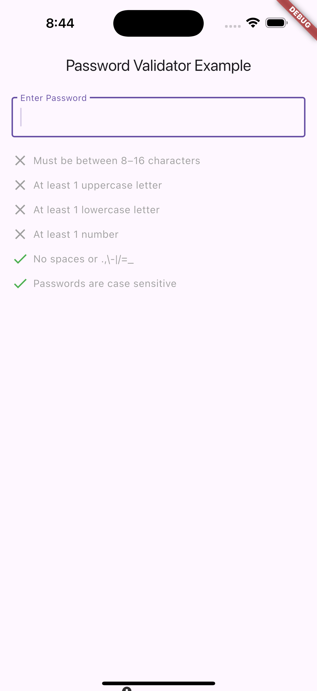
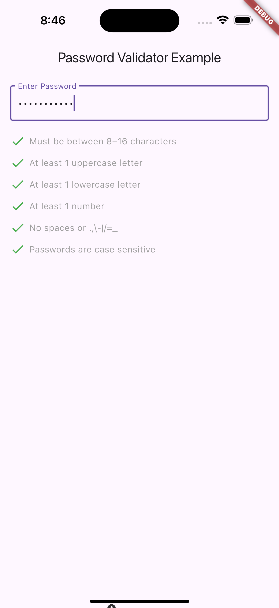

# Password Validator Mate

A fully customizable **Flutter password validation widget**.  
Supports **default rules**, **custom rules**, **global/individual customization**, colors, and flexible validation states.

---

## 📸 Screenshots

<p align="center">
  
  
</p>

---

## ✨ Features

- Predefined password validation rules:
    - Minimum/Maximum length (configurable, max optional)
    - At least one uppercase letter (configurable min count)
    - At least one lowercase letter (configurable min count)
    - At least one number (configurable min count)
    - No spaces or disallowed symbols
    - Case sensitivity info
- Support for **custom rules**
- **Global or per-rule customization**:
    - Pass/Fail widgets (e.g., icons, images, checkmarks)
    - Pass/Fail colors (for icon and text)
- Custom divider and text style
- Real-time validation with `onValidationChanged`
- Null-safe and fully customizable
- Ready-to-use widget for any Flutter form

---

## 📦 Installation

Add the dependency in your `pubspec.yaml`:

```yaml
password_validator_mate: ^1.0.0
```

---

## 🚀 Usage

### Basic Example

```dart
import 'package:flutter/material.dart';
import 'package:password_validator_mate/password_validator_mate.dart';

class PasswordExample extends StatefulWidget {
  @override
  _PasswordExampleState createState() => _PasswordExampleState();
}

class _PasswordExampleState extends State<PasswordExample> {
  final TextEditingController _controller = TextEditingController();
  bool _isPasswordValid = false;

  @override
  Widget build(BuildContext context) {
    return Scaffold(
      appBar: AppBar(title: Text("Password Validator Example")),
      body: Padding(
        padding: const EdgeInsets.all(16.0),
        child: Column(
          children: [
            TextField(
              controller: _controller,
              obscureText: true,
              decoration: InputDecoration(labelText: "Enter Password"),
              onChanged: (_) => setState(() {}),
            ),
            const SizedBox(height: 20),
            PasswordValidation(
              password: _controller.text,
              onValidationChanged: (allPassed, results) {
                setState(() => _isPasswordValid = allPassed);
                print("Password valid? $allPassed, details: $results");
              },
            ),
            const SizedBox(height: 20),
            ElevatedButton(
              onPressed: _isPasswordValid ? () {
                ScaffoldMessenger.of(context).showSnackBar(
                  SnackBar(content: Text("Password is valid!")),
                );
              } : null,
              child: Text("Submit"),
            ),
          ],
        ),
      ),
    );
  }
}
```

---

## 🎨 Customization

### 1. Global (Parent-level) Customization
You can set **pass/fail icons**, **colors**, and **text colors** for all rules globally:

```dart
PasswordValidation(
  password: _controller.text,
  passWidget: Icon(Icons.done, color: Colors.green),   // ✅ custom success icon
  failedWidget: Icon(Icons.error, color: Colors.red), // ❌ custom failed icon
  passColor: Colors.green,     // ✅ icon color (fallback)
  failedColor: Colors.red,     // ❌ icon color (fallback)
  passDescriptionColor: Colors.green,  // ✅ description text color
  failedDescriptionColor: Colors.red,  // ❌ description text color
);
```

---

### 2. Child (Rule-level) Customization
Each rule can override global defaults by providing its own **icon**, **color**, or **description**:

```dart
PasswordValidation(
  password: _controller.text,
  rules: [
    PasswordRule(
      description: "At least 2 uppercase letters",
      validator: (p) => RegExp(r'[A-Z]').allMatches(p).length >= 2,
      passedWidget: Icon(Icons.thumb_up, color: Colors.blue),
      failedWidget: Icon(Icons.thumb_down, color: Colors.orange),
      passedColor: Colors.blue,   // ✅ icon & text color if passed
      failedColor: Colors.orange, // ❌ icon & text color if failed
    ),
    PasswordRule.minMaxLength(min: 8, max: 16), // still uses global fallback
  ],
);
```

---

### 3. Custom Item Builder
If you want **full control** of how each rule is rendered:

```dart
PasswordValidation(
  password: _controller.text,
  itemBuilder: (isPassed, description) {
    return ListTile(
      leading: Icon(
        isPassed ? Icons.verified : Icons.cancel,
        color: isPassed ? Colors.green : Colors.red,
      ),
      title: Text(
        description,
        style: TextStyle(
          color: isPassed ? Colors.green : Colors.red,
          fontWeight: FontWeight.bold,
        ),
      ),
    );
  },
);
```

---

## 🔍 Validation Callback

With `onValidationChanged`, you can check if **all rules are passed** or get a **map of rule results**:

```dart
PasswordValidation(
  password: _controller.text,
  onValidationChanged: (allPassed, results) {
    print("Is valid: $allPassed");
    print("Detailed results: $results");
  },
);
```

Example output:

```
Is valid: false
Detailed results: {
  Must be at least 8 characters: true,
  At least One uppercase letter: false,
  At least One number: true
}
```

---

## 🤝 Contributing

Contributions are welcome!  
Feel free to open issues or submit pull requests.

---

## 📜 License

MIT License © 2025
